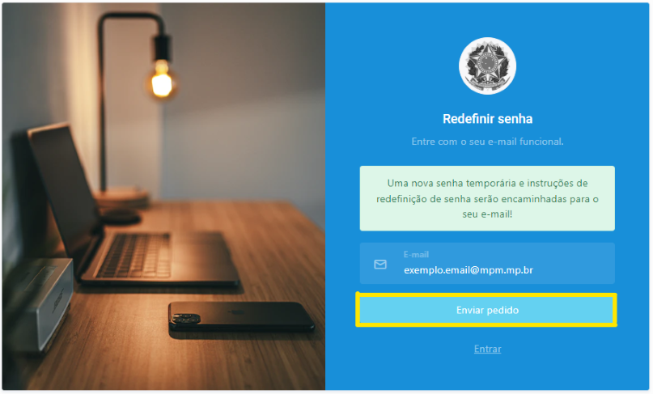

# Primeiro acesso / Esqueci minha senha

A partir de um computador <strong>conectado à rede interna do Ministério Público Militar</strong>, digite em seu navegador (browser) o seguinte endereço: <a href="https://pai.mpm.mp.br/">https://pai.mpm.mp.br/</a>
 

1 Preencha o campo “Usuário” com seu login (Exemplo: roberto.silva) e clique no link “Esqueceu sua senha?” (Figura 1). Em seguida, preencha o campo “E-mail” na página “Redefinir senha” (Figura 2) e clique em “Enviar pedido”. 

 
*Figura 1 - Página de login com destaque ao link para obter senha de primeiro acesso.*   

 
*Figura 2 - Enviar pedido para solicitar senha temporária*.   

2 Acesse o e-mail funcional e verifique a mensagem cujo remetente é <strong>PGJM - SPAI - SUPORTE</strong> (Figura 3). 

  
*Figura 3 - E-mail com novas credenciais de acesso*.   

3 Retorne ao PAI, insira a senha temporária enviada no e-mail e configure uma nova senha seguindo as regras de composição (Figura 4). 

 
*Figura 4 - Página "Criar nova senha".*   

