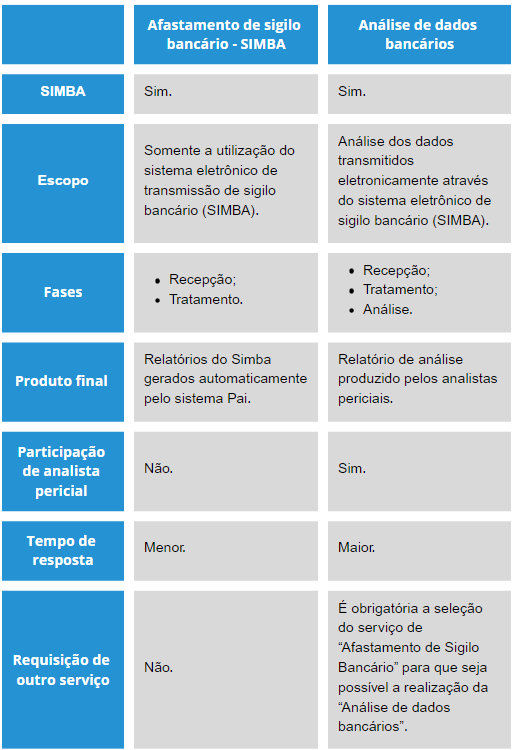

# Criando novo pedido 

1 Clique sobre o botão <strong>"Novo pedido", </strong> localizado no menu lateral esquerdo.

2 Em seguida, será aberta a página contendo um formulário de preenchimento, intitulado “Cadastro do Pedido” (Figura 5).

*Figura 5 - Cadastro do Pedido*.   

Preencha o campo nome, selecione qual a classe de feitos deste caso e digite o número do procedimento. Caso existam pedidos com o mesmo número de procedimento, o PAI apresentará uma tabela listando estes pedidos (Figura 6) e seus respectivos detalhes.    A partir disto, caso algum dentre eles possua vínculo com o pedido que está sendo cadastrado, selecione-o, clicando sobre a linha. Essa indicação tornará o trabalho de análise mais célere.    Por fim, o campo "Origem" do pedido é automaticamente selecionado pelo PAI, de acordo com a lotação do membro que está cadastrando o novo pedido. Porém, caso seja de interesse, é possível alterar este campo de acordo com a lotação desejada. 

*Figura 6 - Pedido com mesmo número de procedimento*.   

##  Campo "Descrição dos Fatos"

Entende-se que o membro solicitante é o detentor das informações mais relevantes do procedimento investigatório. Por essa razão, a contextualização do caso por parte da autoridade é extremamente importante e deve ser feita de forma a subsidiar os analistas com informações preponderantes para análise do pedido.

*Figura 7 - Descrição dos fatos*.   

##  Campo "Necessidades"

O preenchimento deste campo, com o serviço pretendido, permite a SPAI delimitar o escopo do trabalho dos analistas.    É neste campo que o membro deverá descrever da forma mais objetiva possível o que se espera da análise solicitada, indicando os quesitos que se pretende responder para a sustentação da tese de forma a otimizar a alocação dos recursos humanos da SPAI para o atendimento das necessidades descritas e o atingimento do objetivo pretendido de modo mais eficiente e célere.

*Figura 8 - Necessidades*.   

##  Assuntos e Serviços 

3 Em seguida, na página "Novo pedido", selecione os assuntos e os serviços desejados (Figura 9) clicando sobre os ícones <svg xmlns="http://www.w3.org/2000/svg" viewBox="0 0 576 512" width="20" height="20" style="vertical-align: middle;" ><!--! Font Awesome Pro 6.4.2 by @fontawesome - https://fontawesome.com License - https://fontawesome.com/license (Commercial License) Copyright 2023 Fonticons, Inc. --><path d="M384 128c70.7 0 128 57.3 128 128s-57.3 128-128 128H192c-70.7 0-128-57.3-128-128s57.3-128 128-128H384zM576 256c0-106-86-192-192-192H192C86 64 0 150 0 256S86 448 192 448H384c106 0 192-86 192-192zM192 352a96 96 0 1 0 0-192 96 96 0 1 0 0 192z" fill="currentColor" d="m21.68 17.65l-7-14a3 3 0 0 0-5.36 0l-7 14a3 3 0 0 0 3.9 4.08l5.37-2.4a1.06 1.06 0 0 1 .82 0l5.37 2.4a3 3 0 0 0 3.9-4.08Zm-2 2a1 1 0 0 1-1.13.22l-5.37-2.39a3 3 0 0 0-2.44 0L5.41 19.9a1 1 0 0 1-1.3-1.35l7-14a1 1 0 0 1 1.78 0l7 14a1 1 0 0 1-.17 1.13Z"/></svg>. Ao finalizar, clique em "Avançar". 

*Figura 9 - Selecionar Assuntos e Serviços*.   

 Escolha o serviço de acordo com o assunto e as necessidades apontadas no campo específico “necessidades”.   
Na formulação de um novo pedido, além do campo necessidades, há uma lista de assuntos e outra de serviços. Essa segregação é importante, pois os pedidos recebidos na SPAI passam por uma triagem eletrônica, feita pelo próprio sistema, que coloca cada pedido em filas diferentes de acordo com critérios bem definidos (serviço escolhido, assunto, grau de complexidade, etc).    Dessa forma, é de suma importância que o serviço, o assunto e as necessidades estejam em sintonia, para que o atendimento dos pedidos seja otimizado. Some-se a isso, o fato de que a combinação correta desses três itens permite delimitar e orientar a análise, auxiliando na definição do escopo do trabalho dos analistas.  
 

4 Na página seguinte, será disponibilizado um formulário para preenchimento das informações conhecidas pelo demandante acerca dos investigados do pedido, conforme figura a seguir (Figura 10):  

*Figura 10 - Cadastro de investigado(s)*.   

O processo poderá ser repetido enquanto houver investigados a serem cadastrados. Todos os investigados serão incluídos em série na tabela.    É possível, também, através da tabela, editar e excluir dados já cadastrados. O cadastramento de investigados também é aproveitado para outros serviços selecionados dentro da plataforma. 
 

##  Afastamento de Sigilio Bancário SIMBA 

<strong> Caso seja solicitado o serviço “Afastamento de Sigilo Bancário Simba” </strong>, o sistema solicitará que o usuário preencha os campos referentes aos dados gerais do afastamento de sigilo bancário a ser requerido ao Juiz (Figura 11). 

*Figura 11 - Cadastro Afastamento de Sigilo Bancário*.   

  Diferença entre serviço de "Afastamento de sigilo bancário" e "Análise de dados bancários" : 

  
*Figura 12 - Cadastro Afastamento de Sigilo Bancário*.   

Uma exigência do sistema para pedidos com o serviço de afastamento de sigilo é o <strong> download da minuta </strong>, passo este que é obrigatório para o prosseguimento do processo de cadastro por meio do botão “Baixar minuta”.

 <strong>Não copie e cole a minuta!</strong> A ação de copiar e colar, comumente utilizada pelos usuários, pode gerar grandes transtornos ao trâmite do afastamento de sigilo bancário via SIMBA. Por exemplo, se o número do caso for incorretamente informado, irá causar uma série de problemas, como:   

    - Os dados bancários transmitidos cairão em outro caso;  
    - Contamina a prova;  
    - Acaba por evidenciar dados de outro caso guardado por sigilo;  
    - Impossibilita o controle dos dados que deverão ser transmitidos pelos Bancos, inviabilizando, por conseguinte, eventuais cobranças de mora;  
    - Causa ruídos de comunicação entre a SPAI, o Judiciário, o BACEN e as instituições financeiras;   
    - Possibilita que as instituições financeiras aleguem o não recebimento de nenhuma determinação do Banco Central para transmitir eventuais dados pendentes.   

Caso ocorra o envio do PQS ao Judiciário com um número de caso incorreto, assim que detectado o equívoco, será necessária a reiteração do pedido à autoridade judiciária. O membro deverá refazer o pedido, gerar nova minuta (com novo número) e reiterar o pedido ao Juiz, sendo que esse trâmite poderá causar uma excessiva demora até a análise do caso.   

Por fim, sugerimos que a minuta seja utilizada como anexo do PQS! 

 

##  Afastamento de sigilo telefônico - SITTEL 

O SITTEL é um sistema de investigação de registros telefônico e telemático, tendo sido desenvolvido para recebimento e processamento de dados decorrentes de afastamento de sigilo de registros de telefone autorizado pela Justiça.    Pelo sistema, é possível transmitir as ordens judiciais e ofícios requisitórios (ordem extrajudicial) diretamente para as operadoras de telefonia, por meio tecnológico seguro. O SITTEL não realiza interceptação telefônica e nem afastamento do sigilo telemático. 

 Assim, <strong>caso o usuário tenha cadastrado um pedido selecionando o serviço “Afastamento de sigilo telefônico - SITTEL” </strong>, será redirecionado para a tela de formulário de “cadastro do SITTEL”. Nela, é necessário informar qual o tipo de solicitação desejada, "Judicial" ou "Requisição direta (Extrajudicial)" (Figura 13).

 <ul>
    <li style="text-align: justify;"><strong>Pedido judicial:</strong> Pedido que depende da decisão judicial ser proferida pelo juíz. As respostas poderão conter as seguintes informações, dependendo do tipo de alvo solicitado: dados cadastrais, históricos de chamadas, histórico de chamadas (com dados de interlocutores), histórico de IMEI e histórico de conexões. Os tipos de alvos solicitados poderão ser: CPF/CNPJ, outro documento do assinante, terminal, IMEI. </li>
    <li style="text-align: justify;"><strong> Pedido extrajudicial: </strong> Pedido em que o próprio demandante solicita e assina a requisição. Terá como resposta os dados cadastrais e os alvos solicitados poderão ser do tipo: CPF/CNPJ, outro documento do assinante, terminal, IMEI. </li> 
 </ul>

*Figura 13 - Formulário de "Cadastro do SITTEL"*.   

Ao clicar em cadastrar alvo, uma modal (janela na página) será aberta (Figura 14) e o usuário poderá escolher qual quebra de sigilo deseja: CPF/CNPJ, Terminal, “Outros tipos de documentos” (passaporte, RNE...), IMEI (Identificação Internacional de Equipamento Móvel) e IP/Porta.   

Além disso, também é possível requerer informações adicionais de interlocutores (pessoas que tiveram interações telefônicas com o investigado), dados de ERB (informações relacionadas a uma Estação Rádio Base, possibilitando saber à qual torre telefônica o investigado estava conectado) e de histórico de conexões.   

Uma exigência do sistema para pedidos com o serviço de afastamento de sigilo é o <strong> download da minuta </strong>, passo este que é obrigatório para o prosseguimento do processo de cadastro por meio do botão “Baixar minuta” (Figura 15). 

*Figura 14 - Modo de seleção de tipo de requisição*.   

*Figura 15 - Baixar minuta*.   

5 Por fim, é disponibilizada a página que possibilita a inclusão de arquivos (Upload) no pedido e o botão “Finalizar” para a conclusão do cadastro do novo pedido, conforme figura a seguir (Figura 16): 

*Figura 16 - Upload de Arquivos*.   

##  Pedido pronto

Pedidos feitos por meio do PAI são categorizados pelo próprio sistema, não havendo ingerência humana nesse processo. Essa categorização é feita de acordo com regras predeterminadas e baseiam-se nos serviços que foram escolhidos pelo membro, gerando filas de pedidos que são rigorosamente obedecidas.   

Além das filas de pedidos, a disponibilidade de analista, a complexidade do(s) serviço(s) solicitado(s) e a complexidade do caso impossibilitam o estabelecimento de uma data precisa sobre o término da análise do pedido.   

Quando o trabalho da SPAI é terminado e o pedido concluído, o membro demandante receberá e-mail automático do sistema informando sobre a conclusão do trabalho e a disponibilização do relatório respectivo. 
 
