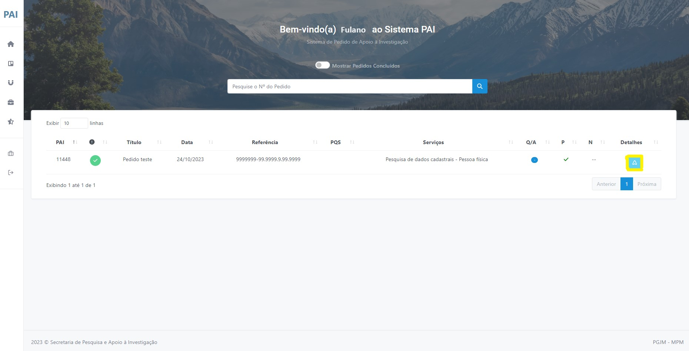
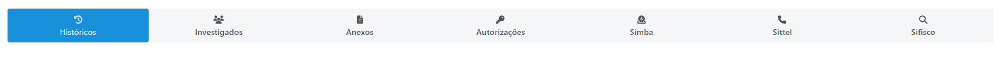
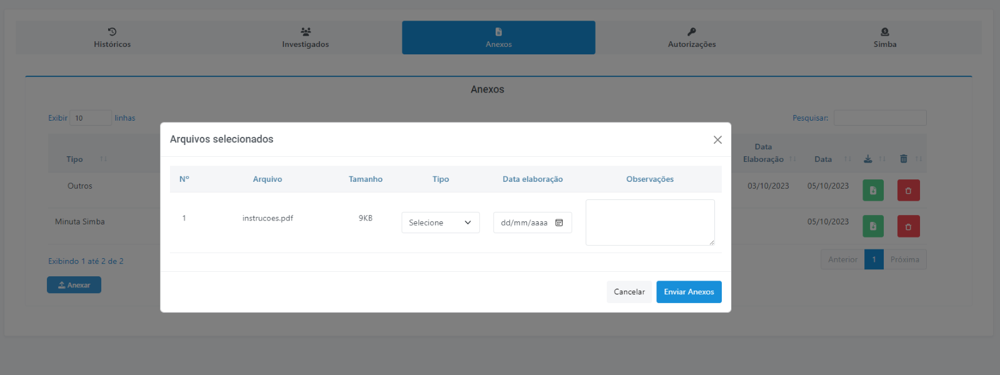
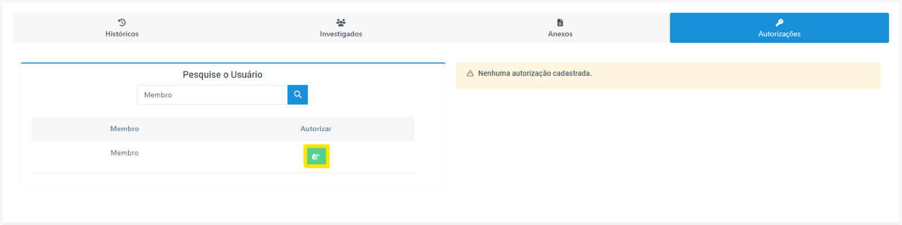
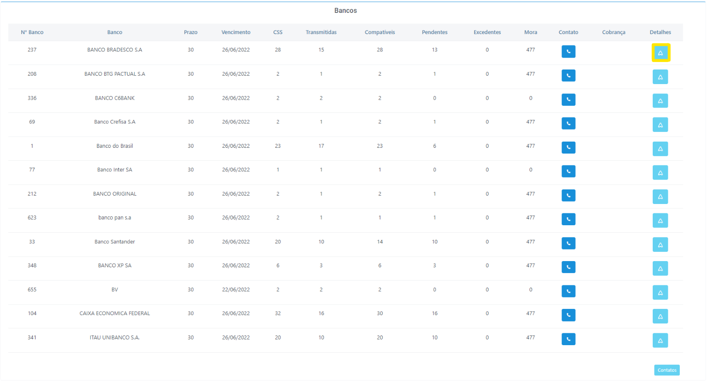
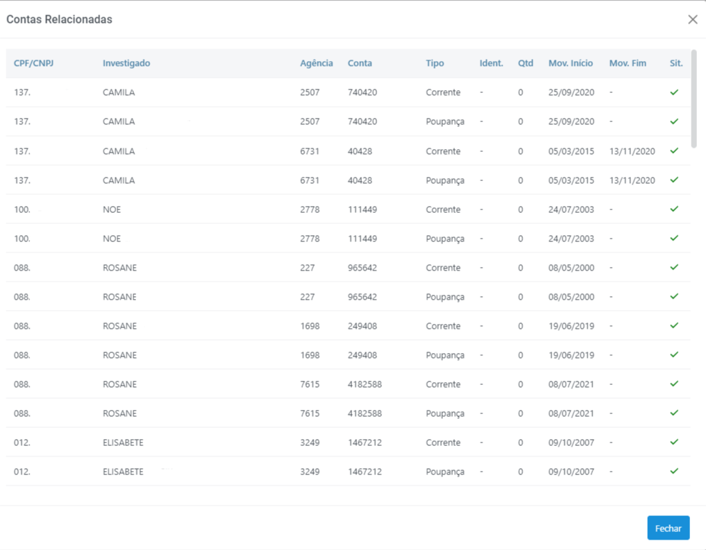
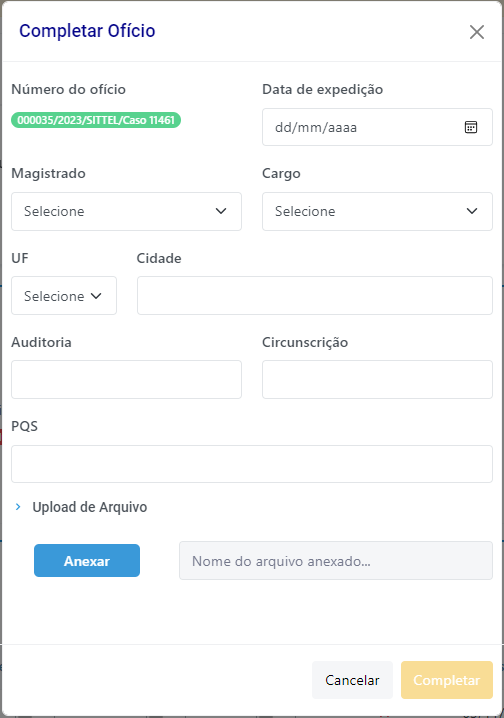
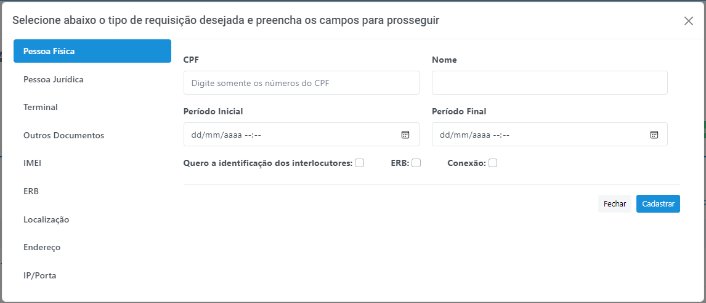
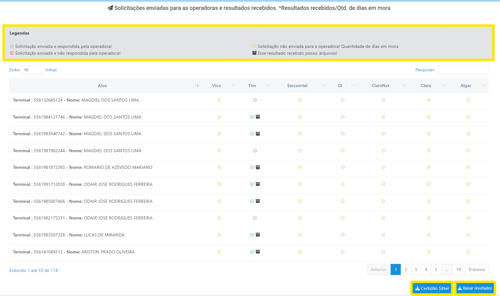
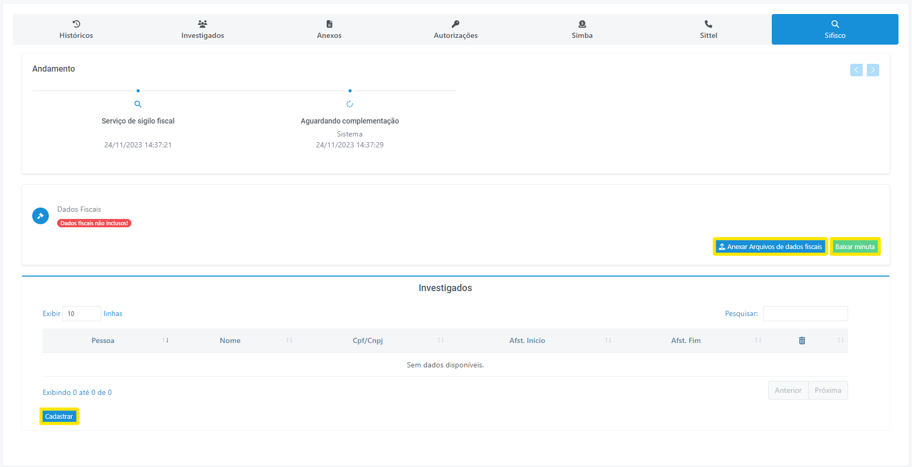

# Meus pedidos

Permite que o membro visualize todos os pedidos feitos até a data corrente. Inicialmente são mostrados apenas os pedidos em andamento, mas, caso o membro queira enxergar todos os pedidos já cadastrados, basta acionar o botão “Mostrar Pedidos Concluídos”, localizado no centro da página (Figura 17). 

## Detalhes do pedido
Para navegar pelos detalhes do pedido, clique no botão <svg xmlns="http://www.w3.org/2000/svg" width="24" height="24" viewBox="0 0 24 24"><path fill="currentColor" d="m21.68 17.65l-7-14a3 3 0 0 0-5.36 0l-7 14a3 3 0 0 0 3.9 4.08l5.37-2.4a1.06 1.06 0 0 1 .82 0l5.37 2.4a3 3 0 0 0 3.9-4.08Zm-2 2a1 1 0 0 1-1.13.22l-5.37-2.39a3 3 0 0 0-2.44 0L5.41 19.9a1 1 0 0 1-1.3-1.35l7-14a1 1 0 0 1 1.78 0l7 14a1 1 0 0 1-.17 1.13Z"/></svg> apresentado na tela, conforme mostrado na figura a seguir: (Figura 17)

*Figura 17 - Acessar os detalhes dos pedidos*.   

## Status do pedido
Os possíveis status do pedido são: 
<ul>
<li style="text-align: justify;"><strong>Aguardando Despacho: </strong>Pedidos que estão aguardando despacho do coordenador, seja na fase de admissibilidade ou em outra fase que requeira seu posicionamento. Por exemplo, quando um atendimento bancário foi concluído e aguarda a distribuição ao analista responsável, ou ainda quando um analista conclui a análise e o pedido aguarda ser concluído.</li>
<li style="text-align: justify;"><strong>Andamento: </strong> Refere-se aos pedidos recebidos na SPAI e que já passaram pela fase de admissibilidade, tendo recebido algum despacho do coordenador. Os casos em andamento poderão ser distribuídos ao analista, em fase de análise e pesquisa, dentre outros. Essas informações podem ser verificadas no histórico do pedido. </li>
<li style="text-align: justify;"><strong>Encerrado: </strong> Refere-se aos pedidos que foram encerrados pelo próprio membro ou pelo coordenador. Um exemplo de encerramento por parte do membro ocorre quando os autos que motivaram a abertura do pedido foram arquivados. O coordenador pode encerrar um pedido por falta de acessibilidade.  </li>
<li style="text-align: justify;"><strong>Pendente: </strong> São os pedidos que aguardam um despacho ou manifestação externa a SPAI. Exemplos de pedidos pendentes são aqueles que estão aguardando uma diligência, um pedido de retransmissão, uma solicitação de dilação de prazo, a chegada de uma nova quebra de sigilo etc.  </li>
<li style="text-align: justify;"><strong>Aguardando transmissão de dados: </strong> São aqueles que estão na fase de recepção e tratamento dos dados que são transmitidos pelas instituições financeiras.  </li>
<li style="text-align: justify;"><strong>Concluído: </strong>São os pedidos que já passaram por todas as etapas do processo de análise, tendo-os como finalizados.  </li>

</ul>

## Ações em detalhes do pedido

 
*Figura 18 - Ações em detalhes do pedido*.  

<ul>
<li style="text-align: justify;">Encerrar: Encerre um pedido clicando no botão em vermelho “Encerrar”. Descreva a motivação que justifique o encerramento do pedido e confirme.</li>

 É recomendável que de tempos em tempos o membro verifique se há algum pedido feito à SPAI que já pode ser encerrado. Por exemplo, quando ainda não foi atendido, mas já houve a solução da lide, ou quando o caso foi arquivado ou ainda quando o juiz indeferiu um pedido de afastamento de sigilo.  
</li>
<li style="text-align: justify;">Editar pedido: Edite um pedido clicando no botão em amarelo “Editar pedido”. Descreva a motivação para a edição e em seguida realize as alterações necessárias. Por fim, clique em “Salvar”.</li>
<li style="text-align: justify;">Certidão: Obtenha a certidão do pedido clicando no botão em azul “Certidão”. Através deste documento o demandante reporta ao juiz qual é o status atual do pedido.  </li>
</ul>

##  Abas do pedido 

*Figura 19 - Modal "Abas do pedido"*.   

####  Histórico 

Permite que os demandantes e os integrantes da SPAI acompanhem todas as alterações ocorridas no pedido e nos serviços requeridos, realizadas pelos membros ou por servidores da própria SPAI. Além disso, possibilita ao membro a inclusão de informações a qualquer tempo que julgue importante para o andamento do pedido e dos serviços requisitados. Ao cadastrar um novo histórico, por serviço requerido, a área responsável da SPAI será automaticamente notificada por e-mail sobre a inclusão de um novo registro de histórico. No entanto, nos casos em que já houve a conclusão ou o encerramento do pedido, o pedido deverá ser previamente reaberto. 
 

####  Investigados 

Permite visualizar, editar e excluir os investigados cadastrados no pedido e possibilita o cadastramento de novos investigados, tanto de “pessoa física” quanto de “pessoa jurídica”. 
 

####  Anexos 

Permite anexar arquivos no sistema. Funciona de maneira similar ao recurso “Anexar Arquivo’ da maioria das ferramentas de e-mail. O sistema suporta anexos de arquivos de até 25MB. 

    

 Após clicar no botão “Anexar” irá aparecer uma janela pop-up (Figura x) na qual será possível localizar o arquivo em seu computador. Selecione o tipo de anexo (preenchimento obrigatório), a data de elaboração e insira uma observação (preenchimento não obrigatório) para o documento. Por fim, clique em “Enviar anexos”. 

*Figura 20 - Menu anexos*   

####  Autorizações 
Autorizações: </strong>utilizado para que o membro titular do pedido possa autorizar outros usuários a visualizarem um pedido. 

 Dentro da aba “Autorizações”, em “Pesquise o Usuário”, digite o nome do membro ao qual você deseja conceder acesso ao pedido. Em seguida, clique no botão <svg xmlns="http://www.w3.org/2000/svg" height="1em" viewBox="0 0 512 512"><!--! Font Awesome Free 6.4.2 by @fontawesome - https://fontawesome.com License - https://fontawesome.com/license (Commercial License) Copyright 2023 Fonticons, Inc. --><path d="M448 128l-177.6 0c1 5.2 1.6 10.5 1.6 16l0 16 32 0 144 0c8.8 0 16-7.2 16-16s-7.2-16-16-16zM224 144c0-17.7-14.3-32-32-32c0 0 0 0 0 0l-24 0c-66.3 0-120 53.7-120 120l0 48c0 52.5 33.7 97.1 80.7 113.4c-.5-3.1-.7-6.2-.7-9.4c0-20 9.2-37.9 23.6-49.7c-4.9-9-7.6-19.4-7.6-30.3c0-15.1 5.3-29 14-40c-8.8-11-14-24.9-14-40l0-40c0-13.3 10.7-24 24-24s24 10.7 24 24l0 40c0 8.8 7.2 16 16 16s16-7.2 16-16l0-40 0-40zM192 64s0 0 0 0c18 0 34.6 6 48 16l208 0c35.3 0 64 28.7 64 64s-28.7 64-64 64l-82 0c1.3 5.1 2 10.5 2 16c0 25.3-14.7 47.2-36 57.6c2.6 7 4 14.5 4 22.4c0 20-9.2 37.9-23.6 49.7c4.9 9 7.6 19.4 7.6 30.3c0 35.3-28.7 64-64 64l-64 0-24 0C75.2 448 0 372.8 0 280l0-48C0 139.2 75.2 64 168 64l24 0zm64 336c8.8 0 16-7.2 16-16s-7.2-16-16-16l-48 0-16 0c-8.8 0-16 7.2-16 16s7.2 16 16 16l64 0zm16-176c0 5.5-.7 10.9-2 16l2 0 32 0c8.8 0 16-7.2 16-16s-7.2-16-16-16l-32 0 0 16zm-24 64l-40 0c-8.8 0-16 7.2-16 16s7.2 16 16 16l48 0 16 0c8.8 0 16-7.2 16-16s-7.2-16-16-16l-24 0z"/></svg>  para confirmar a operação (Figura 21). 

*Figura 21 - Menu autorizações*.   

####  SIMBA 
<strong>Sistema de Investigação de Movimentações Bancárias.</strong>

Permite anexar "Extensão de Quebra", baixar minuta, visualizar a relação de investigados e a situação de suas respectivas contas em relação às transmissões. Também é possível verificar as contas bancárias, na tabela <u>"Bancos"</u> e os <u>"Relatórios e atendimentos recebidos."</u>
 

<strong> Bancos (Figura 22): </strong>

*Figura 22 - Menu anexos*.  

A partir dessa janela, clicando em "Detalhes" poderão ser obtidas outras informações a respeito das transmissões como, por exemplo, dados do investigado, números de contas, agências e bancos, nível de identificação da origem e destino, períodos etc. (Figura 23)
  

*Figura 23 - Aba "Contas Relacionadas"*.  

As colunas da tabela contidas nessa janela possuem o seguinte significado: 
<ul>
<li style="text-align: justify;">CPF/CNPJ: CPF ou CNPJ do investigado. </li>
<li style="text-align: justify;">Investigado: Nome do investigado.   </li>
<li style="text-align: justify;">Agência: Número da agência bancária do investigado.   </li>
<li style="text-align: justify;">Conta: Número da conta bancária do investigado.  </li>
<li style="text-align: justify;">Tipo: Tipo da conta bancária (conta corrente, poupança, investimento etc.). </li>
<li style="text-align: justify;">Ident.: Percentual de identificação dos registros que compõem o extrato da conta transmitida. Algumas transações bancárias tais como TED, DOC e outras devem ser identificadas de modo a facilitar análises bancárias.  </li>
<li style="text-align: justify;">Qtd: Quantidade de linhas que compõem o extrato da conta transmitida.  </li>
<li style="text-align: justify;">Mov. Início: Data da primeira movimentação da conta.  </li>
<li style="text-align: justify;">Mov. Fim: Data das últimas movimentações da conta.  </li>
<li style="text-align: justify;">Sit.: A situação é representada através dos seguintes ícones: </li>
<ul>
<li style="text-align: justify;"><svg xmlns="http://www.w3.org/2000/svg" height="1em" viewBox="0 0 448 512"><!--! Font Awesome Free 6.4.2 by @fontawesome - https://fontawesome.com License - https://fontawesome.com/license (Commercial License) Copyright 2023 Fonticons, Inc. --><path d="M438.6 105.4c12.5 12.5 12.5 32.8 0 45.3l-256 256c-12.5 12.5-32.8 12.5-45.3 0l-128-128c-12.5-12.5-12.5-32.8 0-45.3s32.8-12.5 45.3 0L160 338.7 393.4 105.4c12.5-12.5 32.8-12.5 45.3 0z" style="fill: green;"/></svg> : Indica que a conta transmitida consta do CCS;
</li>
<li style="text-align: justify;"><svg xmlns="http://www.w3.org/2000/svg" height="1em" viewBox="0 0 512 512"><!--! Font Awesome Free 6.4.2 by @fontawesome - https://fontawesome.com License - https://fontawesome.com/license (Commercial License) Copyright 2023 Fonticons, Inc. --><path d="M256 32c14.2 0 27.3 7.5 34.5 19.8l216 368c7.3 12.4 7.3 27.7 .2 40.1S486.3 480 472 480H40c-14.3 0-27.6-7.7-34.7-20.1s-7-27.8 .2-40.1l216-368C228.7 39.5 241.8 32 256 32zm0 128c-13.3 0-24 10.7-24 24V296c0 13.3 10.7 24 24 24s24-10.7 24-24V184c0-13.3-10.7-24-24-24zm32 224a32 32 0 1 0 -64 0 32 32 0 1 0 64 0z"/></svg> : Indica que a conta consta do CCS, mas não foi transmitida;
</li>
<li style="text-align: justify;"><svg xmlns="http://www.w3.org/2000/svg" height="1em" viewBox="0 0 384 512"><!--! Font Awesome Free 6.4.2 by @fontawesome - https://fontawesome.com License - https://fontawesome.com/license (Commercial License) Copyright 2023 Fonticons, Inc. --><path d="M376.6 84.5c11.3-13.6 9.5-33.8-4.1-45.1s-33.8-9.5-45.1 4.1L192 206 56.6 43.5C45.3 29.9 25.1 28.1 11.5 39.4S-3.9 70.9 7.4 84.5L150.3 256 7.4 427.5c-11.3 13.6-9.5 33.8 4.1 45.1s33.8 9.5 45.1-4.1L192 306 327.4 468.5c11.3 13.6 31.5 15.4 45.1 4.1s15.4-31.5 4.1-45.1L233.7 256 376.6 84.5z" style="fill: red;"/></svg> : Indica uma conta excedente, ou seja, não consta do CCS.
</li>
</ul>
</ul>

####  SITTEL 
<strong>Sistema de Investigação de Registros Telefônico e Telemático.</strong>

Permite baixar minuta e complementar o ofício. Complemente o ofício (Figura 24) com os dados presentes na decisão judicial, seguindo as seguintes etapas: 

<ul>
<li style="text-align: justify;">Data de expedição: Data de emissão do ofício.</li>
<li style="text-align: justify;">Magistrado: Nome do juiz assinante da decisão judicial.</li>
<li style="text-align: justify;">Cargo: Cargo do juiz assinante da decisão judicial.</li>
<li style="text-align: justify;">UF: Estado da auditoria militar respectiva.</li>
<li style="text-align: justify;">Cidade: Cidade da auditoria militar respectiva.</li>
<li style="text-align: justify;">Auditoria: Identificação da vara criminal.</li>
<li style="text-align: justify;">Circusncrição: Área de competência, atuação e autoridade do juiz.</li>
<li style="text-align: justify;">PQS: Número do pedido de quebra de sigilo.</li>
<li style="text-align: justify;">Upload de Arquivo: Campo para anexar a decisão judicial.</li>
</ul>

 
*Figura 24 - Complementar Ofício.*   

Também é possível cadastrar alvos (Figura 25). Os tipos de requisição disponíveis são: 
<li style="text-align: justify;"> Pessoa Física </li>
<li style="text-align: justify;"> Pessoa Jurídica </li>
<li style="text-align: justify;"> Terminal </li>
<li style="text-align: justify;"> Outros Documentos (Passaporte, RG, RNE...)</li>
<li style="text-align: justify;"> IMEI (Identificação Internacional de Equipamento Móvel) </li>
<li style="text-align: justify;"> ERB (Estação Rádio Base) 

 CGI: Imagens geradas por computador
</li>
<li style="text-align: justify;"> Localização (a partir da Latitude e Longitude)</li>
<li style="text-align: justify;"> Endereço</li>
<li style="text-align: justify;"> IP/Porta</li>

 
*Figura 25 - Cadastrar Alvo.*   

Por fim, na última tabela, é possível acompanhar o andamento da investigação dos alvos, baixar arquivo zip com os resultados recebidos e fazer download da "Certidão Sittel" (Figura 26). 
 

 
*Figura 26 - Status das solicitações enviadas para as operadoras.*   

###  SIFISCO  

<strong>Sistema de Investigação Fiscal.</strong> 

Na Aba SIFISCO (Figura 27) é possível acompanhar o andamento do pedido, anexar arquivos de dados fiscais, baixar minuta e cadastrar investigados (pessoa física ou pessoa jurídica). 
 

 
*Figura 27 - Aba SIFISCO*.  

  

