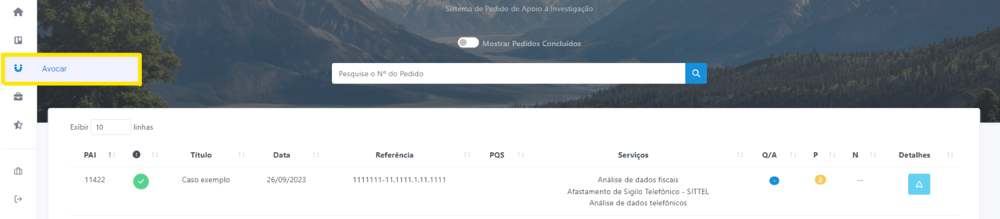
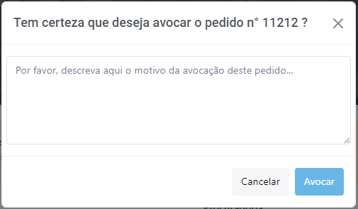

# Avocar pedido 

1 Clique no botão “Avocar”, localizado no menu lateral (Figura 28).
 

*Figura 28 - Menu lateral "Avocar"*.   

2 Na página que será aberta (Figura 29), a pesquisa do pedido a ser avocado poderá ser feita a partir do <strong>número completo do PAI</strong>, do processo de referência ou do número do PQS. Em seguida, basta clicar em “Pesquisar” e aguardar a listagem dos resultados na tela. Clique no ícone  <svg xmlns="http://www.w3.org/2000/svg" height="16" width="14" viewBox="0 0 448 512"><!--!Font Awesome Free 6.5.0 by @fontawesome - https://fontawesome.com License - https://fontawesome.com/license/free Copyright 2023 Fonticons, Inc.--><path d="M0 160v96C0 379.7 100.3 480 224 480s224-100.3 224-224V160H320v96c0 53-43 96-96 96s-96-43-96-96V160H0zm0-32H128V64c0-17.7-14.3-32-32-32H32C14.3 32 0 46.3 0 64v64zm320 0H448V64c0-17.7-14.3-32-32-32H352c-17.7 0-32 14.3-32 32v64z" fill="currentColor" d="m21.68 17.65l-7-14a3 3 0 0 0-5.36 0l-7 14a3 3 0 0 0 3.9 4.08l5.37-2.4a1.06 1.06 0 0 1 .82 0l5.37 2.4a3 3 0 0 0 3.9-4.08Zm-2 2a1 1 0 0 1-1.13.22l-5.37-2.39a3 3 0 0 0-2.44 0L5.41 19.9a1 1 0 0 1-1.3-1.35l7-14a1 1 0 0 1 1.78 0l7 14a1 1 0 0 1-.17 1.13Z"/></svg> para avocar o pedido desejado.  
 

*Figura 29 - Avocar pedido*.   

3 Por fim, será aberta na tela uma janela para justificar o motivo da avocação (férias, licença, remoção, aposentadoria do titular). Basta descrever o motivo e clicar em “Avocar”. 

 
*Figura 30 - Menu botão de avocação*.   

