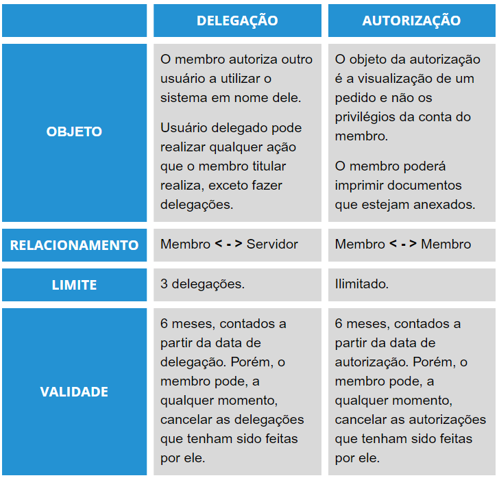

# Avocar pedido 

 Clique no botão “Avocar”, localizado no menu lateral (Figura x).
 

*Figura x - Menu lateral "Avocar"*.   

 Na página que será aberta (Figura x), a pesquisa do pedido a ser avocado poderá ser feita a partir do <strong>número completo do PAI</strong>, do processo de referência ou do número do PQS. Em seguida, basta clicar em “Pesquisar” e aguardar a listagem dos resultados na tela. Clique no ícone  <svg xmlns="http://www.w3.org/2000/svg" height="16" width="14" viewBox="0 0 448 512"><!--!Font Awesome Free 6.5.0 by @fontawesome - https://fontawesome.com License - https://fontawesome.com/license/free Copyright 2023 Fonticons, Inc.--><path d="M0 160v96C0 379.7 100.3 480 224 480s224-100.3 224-224V160H320v96c0 53-43 96-96 96s-96-43-96-96V160H0zm0-32H128V64c0-17.7-14.3-32-32-32H32C14.3 32 0 46.3 0 64v64zm320 0H448V64c0-17.7-14.3-32-32-32H352c-17.7 0-32 14.3-32 32v64z"/></svg> para avocar o pedido desejado.  
 

*Figura x - Avocar pedido*.   

 Por fim, será aberta na tela uma janela para justificar o motivo da avocação (férias, licença, remoção, aposentadoria do titular). Basta descrever o motivo e clicar em “Avocar”. 

 
*Figura x - Menu botão de avocação*.   

## Diferença entre delegação e autorização

 
*Figura x - Delegação x Autorização*.   

