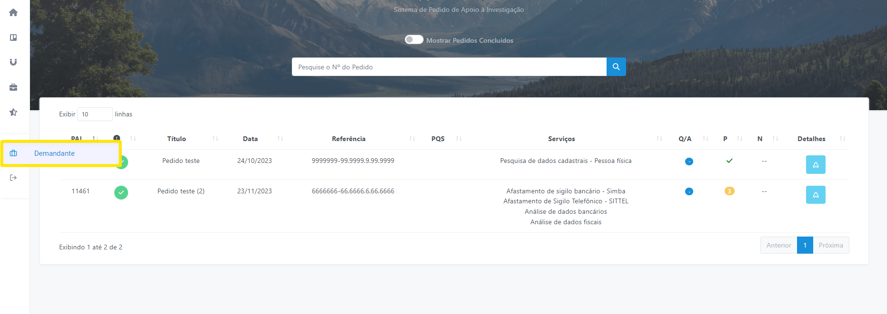
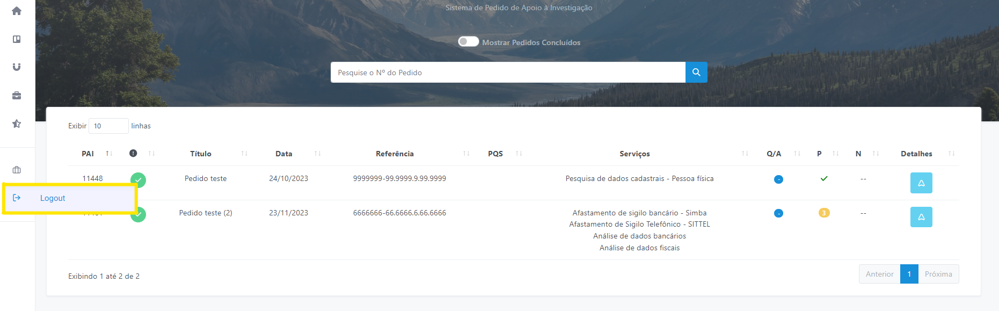

# Perfil / Logout

Caso o usuário possua mais de um perfil cadastrado no sistema, é possível alternar o perfil de acesso clicando no botão localizado na aba esquerda da página, conforme imagem a seguir (Figura 35): 

*Figura 35 - Alterar perfil de acesso*.   

 Para fazer Logout no sistema PAI, basta clicar no botão <svg xmlns="http://www.w3.org/2000/svg" height="16" width="16" viewBox="0 0 512 512"><!--!Font Awesome Free 6.5.1 by @fontawesome - https://fontawesome.com License - https://fontawesome.com/license/free Copyright 2023 Fonticons, Inc.--><path d="M377.9 105.9L500.7 228.7c7.2 7.2 11.3 17.1 11.3 27.3s-4.1 20.1-11.3 27.3L377.9 406.1c-6.4 6.4-15 9.9-24 9.9c-18.7 0-33.9-15.2-33.9-33.9l0-62.1-128 0c-17.7 0-32-14.3-32-32l0-64c0-17.7 14.3-32 32-32l128 0 0-62.1c0-18.7 15.2-33.9 33.9-33.9c9 0 17.6 3.6 24 9.9zM160 96L96 96c-17.7 0-32 14.3-32 32l0 256c0 17.7 14.3 32 32 32l64 0c17.7 0 32 14.3 32 32s-14.3 32-32 32l-64 0c-53 0-96-43-96-96L0 128C0 75 43 32 96 32l64 0c17.7 0 32 14.3 32 32s-14.3 32-32 32z" fill="currentColor" d="m21.68 17.65l-7-14a3 3 0 0 0-5.36 0l-7 14a3 3 0 0 0 3.9 4.08l5.37-2.4a1.06 1.06 0 0 1 .82 0l5.37 2.4a3 3 0 0 0 3.9-4.08Zm-2 2a1 1 0 0 1-1.13.22l-5.37-2.39a3 3 0 0 0-2.44 0L5.41 19.9a1 1 0 0 1-1.3-1.35l7-14a1 1 0 0 1 1.78 0l7 14a1 1 0 0 1-.17 1.13Z"/></svg> localizado na aba esquerda da página, conforme imagem a seguir (Figura 36): 

*Figura 36 - Sair*.   
